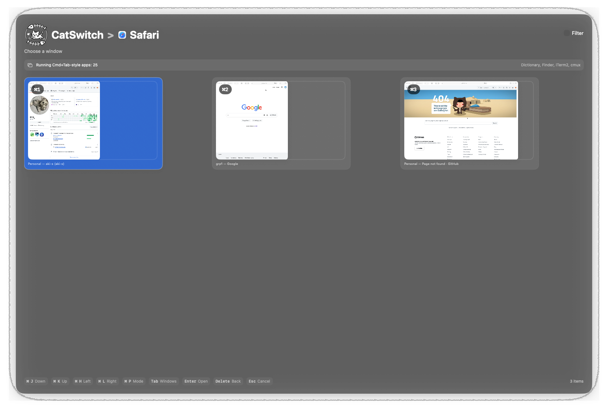

last modified: 2026-07-07T01:11:35 UTC

This doc is for v0.1.3 (Distributed version is v0.2.0. It has more features!)

## About

`CatSwitch` is a **cat**egorical {application,window} **switch**er


 ⭐️ Recommended to all software developers or multi-taskers.

- If you often get lost for a while to switch between apps by `⌘+Tab`, then this app free you from the hassle.
- Default shortcut to activate CatSwitch is `⌘+Shift+Space`.

### CatSwitch can..

- Switch between running apps
  - This means you are not annoyed by a bit slow Spotlight switcher. All you need to do is just use Spotlight as a app luncher, then use `CatSwitch` to switch between apps!
- Categorize app groups and define layout as you like
  - After one day of work and visualizing your usage, you can hit to an ideal layout to minimize switching cost!
- Visualize how frequent you switch between each app
- complete switching only keyboard shortcut
  - (`⌘` + jkhl) or (Spotlight-like filter) or (Vimium-like goto shortcut)

- Customize shortcut to activate `CatSwitch`.

### Installation

`CatSwitch` is distributed by **private** tap of Homebrew.

Rough sketch of installation (as of 2026-07-07) is

```sh
brew tap aki-s/tap
brew trust aki-s/tap
brew install aki-s/tap/cat-switch
```

See https://github.com/aki-s/homebrew-tap/, for more details.


### ScreenShots

#### Activate

Filter mode

Pin mode

Filter view after typing `cha`

`tab` on selected app shows window list


#### Define layout

Define layout by drag and drop


The layout file is kept under `~/.config/CatSwitch/`!

#### Analytics

visualize switch frequency in specified period (Categories view. The same layout when you use `CatSwitch`.)


visualize switch frequency in specified period(Circle view.)

