last modified: 2026-07-16T16:57:25 UTC

This doc is for CatSwitch v0.2.0

# About

`CatSwitch` is a **cat**egorical {application,window} **switch**er for MacOS.


 ⭐️ Recommended to all software developers or multi-taskers.

- If you often **get lost for a while** between apps using `⌘+Tab`, this app frees you from the hassle.
- Default shortcut to activate CatSwitch is `⌘+Shift+Space`.

## CatSwitch can

- Switch between running apps
  - This means you won't be annoyed by the slightly slow and cluttered built-in Spotlight switcher. All you need to do is use Spotlight as an app launcher, then use `CatSwitch` to switch between apps.
  - Falls back to Spotlight's index to launch an app if no matching app is currently running. [*](#fallback-to-use-index-of-spotlight)
- Categorize app groups and define **static layouts** as you like [*](#define-layout)
  - This feature helps you **reduce context switching cost** greatly!
- Visualize how frequent you switch between each app [*](#analytics)
  - After one day of work and visualizing your usage, you can hit to an ideal layout to minimize switching cost.
- Complete switching using only keyboard shortcuts [*](#keybindings)
  - (`⌘ + {j,k,h,l}`) or (Spotlight-like filter) or (Vimium-like goto shortcut)

- Customize the shortcut to activate `CatSwitch`. [*](#settings)

## Installation

`CatSwitch` is distributed by **private** tap of Homebrew.

Rough sketch of installation (as of 2026-07-07) is

```sh
brew tap aki-s/tap
brew trust aki-s/tap
brew install aki-s/tap/cat-switch
```

See <https://github.com/aki-s/homebrew-tap/>, for more details.

## How to

### Keybindings

| binding | description |
|---------|-------------|
| `[a-z][a-z]` | Selects an app in 26×26 dimensions (Pin mode). Allows you to **select an app with just 2 keystrokes**. |
| `Enter` | Switch to the focused app |
| `Delete` | Go back one state |
| `Tab` | Preview each window of the focused app |
| `⌘+{h,k,l,j}` | Select app in the {left, up, right, down} direction |
| `⌘+q` | Quit the focused app |
| `⌘+Enter` | Reveal the focused app in Finder |
| ... | |

### Activate

Default keybinding to activate CatSwitch is `⌘+Shift+Space`.

#### Pin mode

This mode is the default.

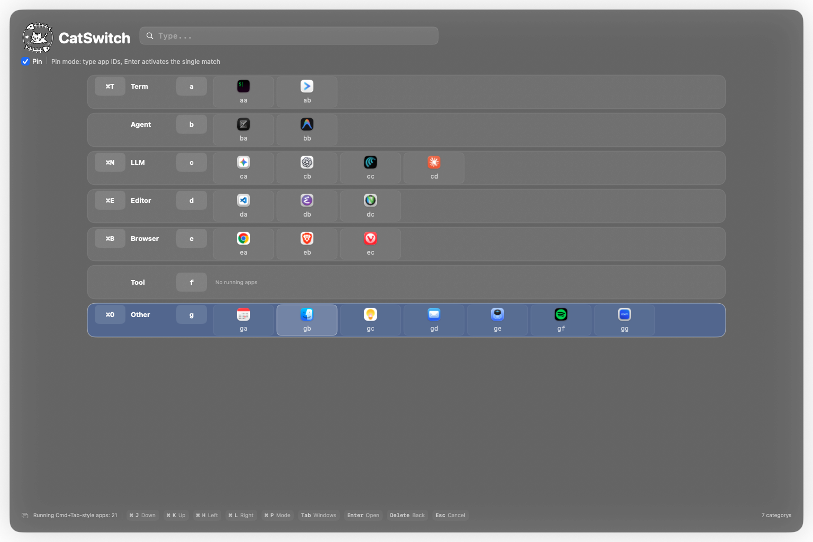

Pin mode view after typing `db` for example.

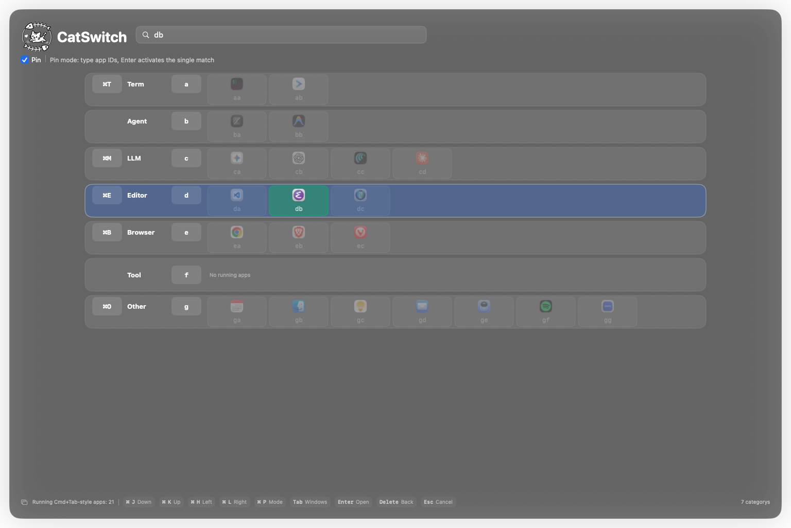

Pin mode view after typing `db` + `Delete` for example.

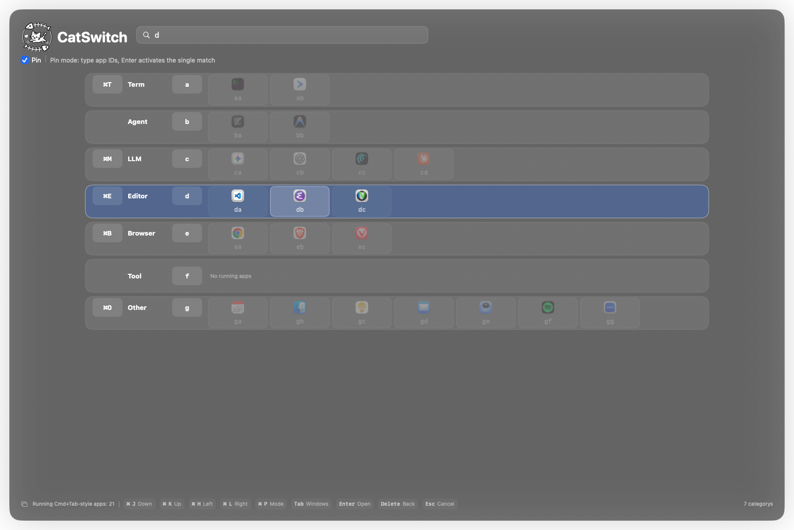

You can also activate the built-in Spotlight with macOS's default shortcut if needed.

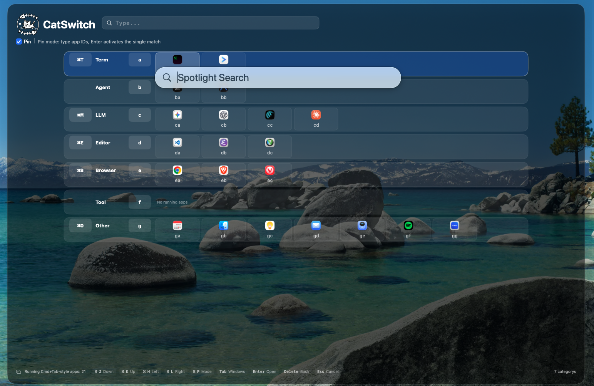

#### Filter mode

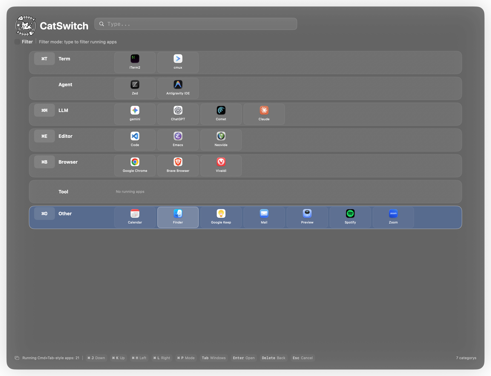

Filter mode view after typing `cha`.
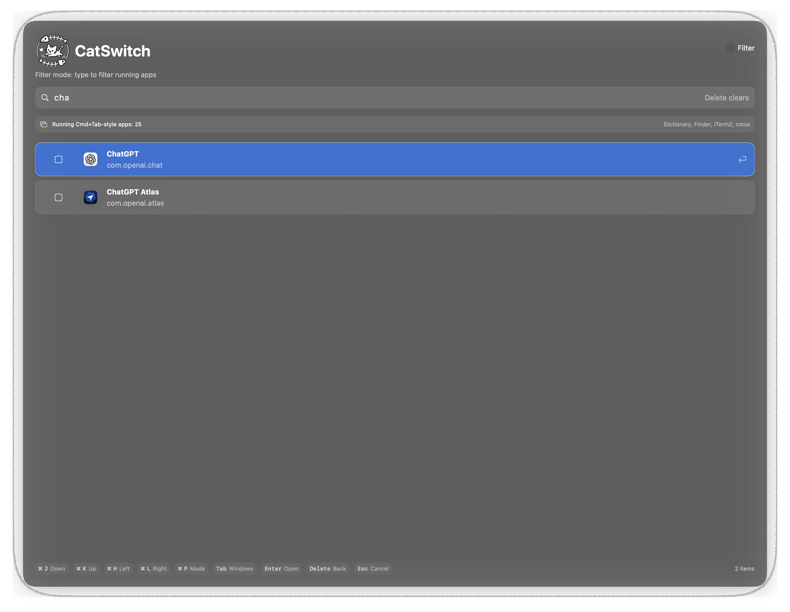

#### Filter by category

Results from `⌘+o` (`o` is a mnemonic for `o`ther).

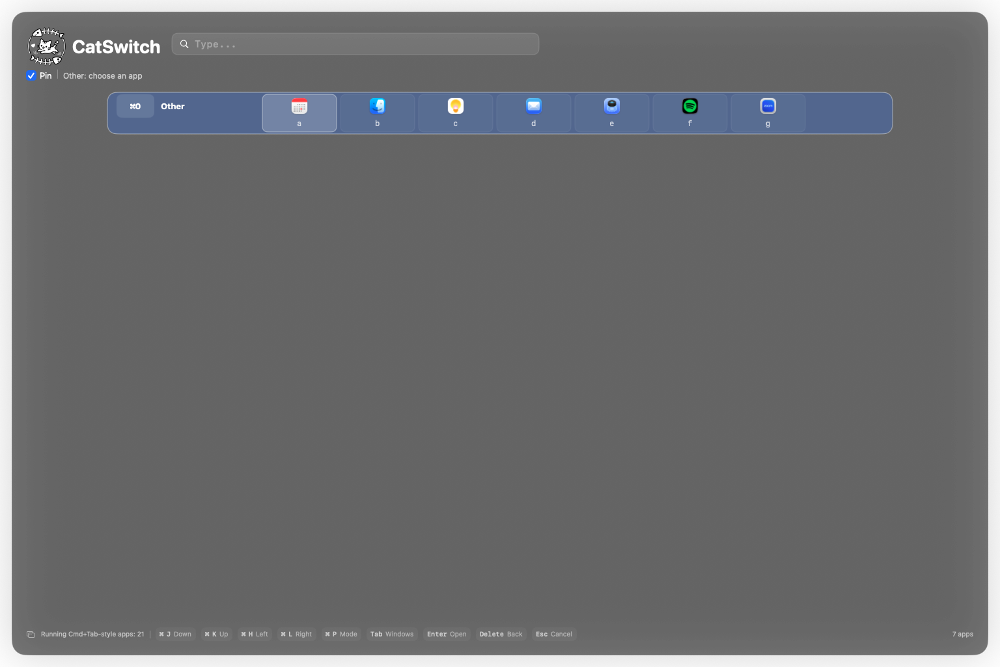

#### Fallback to use index of Spotlight

If no matching app is found after typing more than 2 characters,
the app is searched using the built-in Spotlight index.

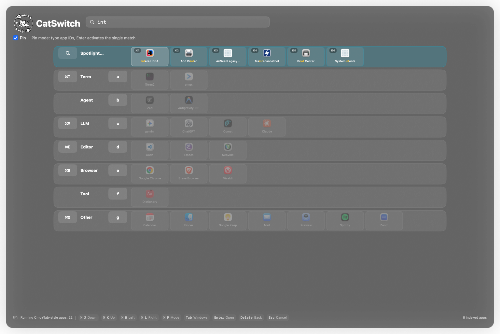

##### Preview

Pressing `Tab` on a selected app displays the window list:
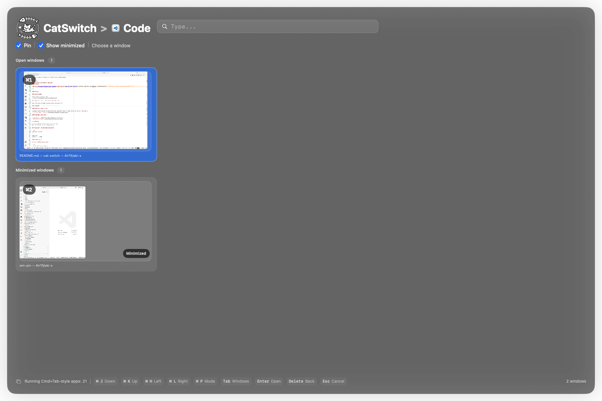

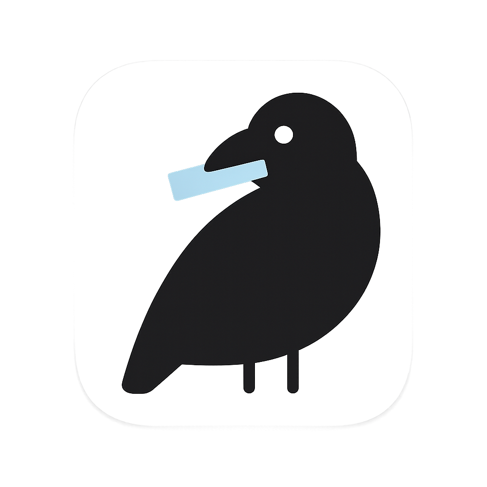 <("caw": Is not this short for `ca`tegorical `w`indow switcher?)

---

### Settings

#### Define layout

Define layout by drag and drop:
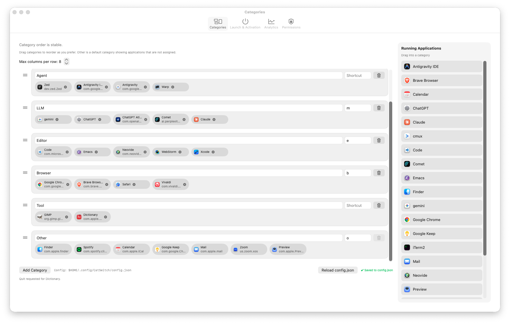

The layout file is stored under `~/.config/CatSwitch/`.

This design is developer-friendly, allowing developers to manage config files under version control.

#### Analytics

##### Analytics category view

Visualize switching frequency over a specified period (Categories view - the same layout used in `CatSwitch`):
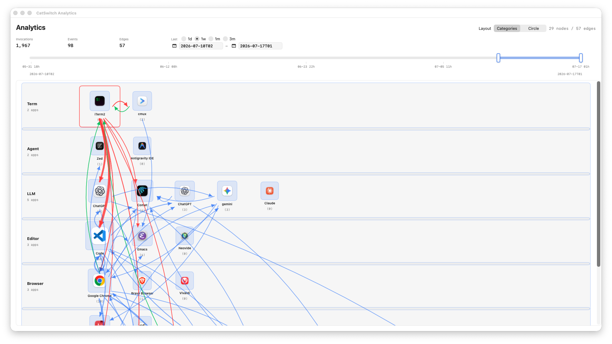

##### Analytics circle view

Visualize switching frequency over a specified period (Circle view):
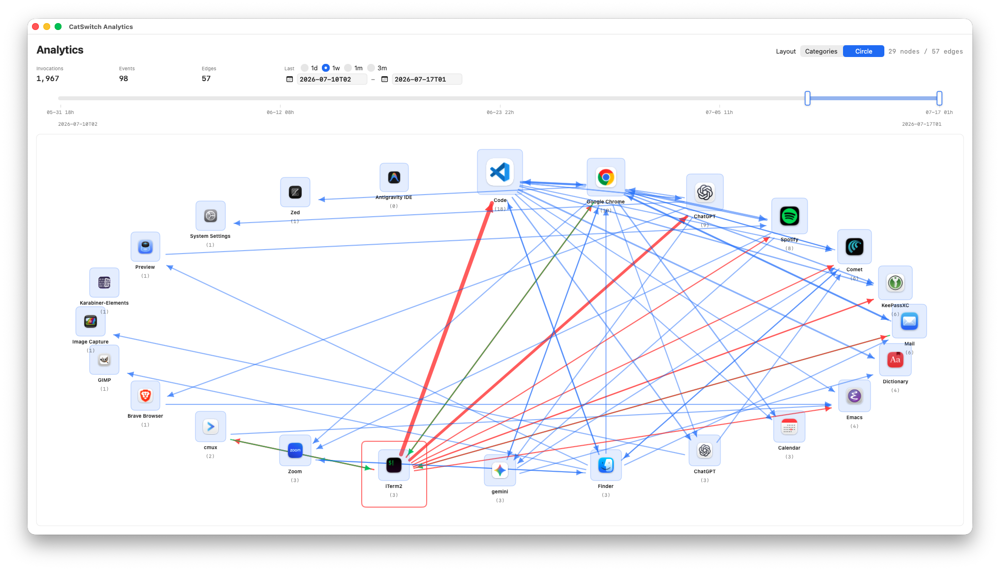

# Development

I currently have no plans to disclose the source code.
The following is for internal reference only.

## Prerequisite (tested build environment)

```sh
xcodebuild -version
```

Xcode 26.5
Build version 17F42

MacOS Tahoe 26.4.1

## Start CatSwitch on your macOS

```sh
./scripts/build-restart-app.sh
```
